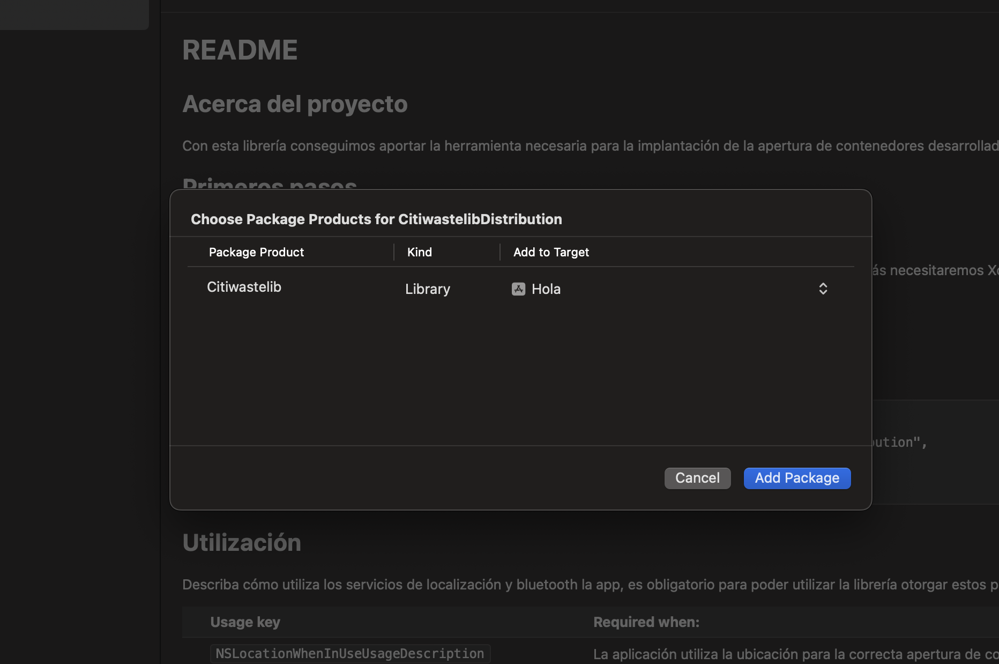

# README

<!-- PROJECT LOGO -->
<br />
<div align="center">
  <a href="https://github.com/citisend-app-libraries/CitiwastelibDistribution">
    
  </a>

  <h3 align="center">Citiwaste Librería para iOS y Android</h3>

</div>


<!-- TABLE OF CONTENTS -->
<details>
  <summary>Tabla de contenidos</summary>
  <ol>
    <li>
      <a href="#about-the-project">Sobre el proyecto</a>
    </li>
    <li>
      <a href="#getting-started">Primeros pasos</a>
      <ul>
        <li><a href="#prerequisites">Requisitos previos</a></li>
      </ul>
    </li>
    <li><a href="#installation">Instalación iOS</a></li>
    <ul>
      <li><a href="#usage">Utilización</a></li>
    </ul>
    <li><a href="#installation">Instalación Android</a></li>
    <ul>
      <li><a href="#usage">Utilización</a></li>
    </ul>
    <li><a href="#contact">Contact</a></li>
  </ol>
</details>


<!-- ABOUT THE PROJECT -->
## Acerca del proyecto

Con esta librería conseguimos aportar la herramienta necesaria para la implantación de la apertura de contenedores desarrollados por [Citisend.io](https://www.citisend.io).

<p align="right">(<a href="#readme-top">volver arriba</a>)</p>


<!-- GETTING STARTED -->
## Primeros pasos

### Requisitos previos

Para la utilización de este proyecto, necesitarás un código de proyecto proporcionado por [Citisend.io](https://www.citisend.io), además necesitaremos Xcode 15 o superior.

## Instalación iOS

1. Swift Package Manager

2. Clonar el repositorio:
   ```
        dependencies: [
            .package(url: "https://github.com/citisend-app-libraries/CitiwastelibDistribution", 
                .upToNextMajor(from: SHOW_LAST_RELEASE_VERSION))
        ]
   ```

<br />
<div align="center">
  <a href="https://github.com/citisend-app-libraries/CitiwastelibDistribution">
    
  </a>
</div>


<p align="right">(<a href="#readme-top">volver arriba</a>)</p>


<!-- USAGE EXAMPLES -->
### Utilización

Describa cómo utiliza los servicios de localización y bluetooth la app, es obligatorio para poder utilizar la librería otorgar estos permisos a la aplicación


| Usage key                                                 | Required when:                                                                   |
|-----------------------------------------------------------|----------------------------------------------------------------------------------|
| `NSLocationWhenInUseUsageDescription`              | La aplicación utiliza la ubicación para la correcta apertura de contenedores Citisend.     |
| `NSLocationAlwaysAndWhenInUseUsageDescription` | La aplicación utiliza la ubicación para la correcta apertura de contenedores Citisend.   |
| `NSLocationTemporaryUsageDescriptionDictionary`             | La aplicación utiliza la ubicación para la correcta apertura de contenedores Citisend. |
| `Privacy - Bluetooth Always Usage Description`             | Utilizamos el bluetooth para la correcta apertura de contenedores Citisend. |
|                                                           |                                                                         |

Importa la librería Citiwastelib:

   ```
    import Citiwastelib
   ```
   
Declara el uso del protocolo CitiConnectProtocol:

   ```
   class ViewController: UIViewController, CLLocationManagerDelegate, CitiConnectProtocol {
   ```
   
Implementa los métodos necesarios para la recepción de eventos:

   ```
    func onTransmision(id: UUID, major: CLBeaconMajorValue, minor: CLBeaconMinorValue) {
       
    }
    
    func onDiscover(name: String, value: Int) {
        switch value {
         case CitiConnect.shared.EVENT_PRESENCE:
            // Presencia detectada 
         default: break
        }
    }
    
    func onEvent(name: String, value: Int) {
        switch value {
        case CitiConnect.shared.EV2_SUCCEED_EVENT:
            // SUCCEEDED
        case CitiConnect.shared.EV2_ERROR_ID_REJECTED_WRONG_PROJECT:
            // WRONG PROJECT
        case CitiConnect.shared.EV2_ERROR_ID_REJECTED_POLITICS_DEVICE_MODE:
            // REJECTED
        default: break
        }
    }
    
    func onError(typeError: Int) {
        CitiConnect.shared.destroy()
        switch typeError {
            case CitiConnect.shared.TIME_OUT:
             // TIME OUT
        default: break
    }
   ```
   
Solicitar el uso de la localización e inicializa la librería

   ```
    override func viewDidLoad() {
        super.viewDidLoad()
        locationManager = CLLocationManager()
        locationManager.delegate = self
        locationManager.requestAlwaysAuthorization()
        
        CitiConnect.shared.delegate = self
        CitiConnect.shared.setUpTimers(timer_lock: 5.0)
    }
   ```   
   
Puedes iniciar el método discover para comenzar el proceso de apertura de contenedor, para iniciar este método necesitas el id de proyecto y el usuario de la app.
  
   ```
     CitiConnect.shared.discover(project_id: project, user_id: user)
   ```   
   
Utiliza destroy() para eliminar la instancia de conexión cuando lo desees.
   
  ```
    CitiConnect.shared.destroy()
  ```  


<p align="right">(<a href="#readme-top">volver arriba</a>)</p>


## Instalación Android

1. Jitpack

2. Configura maven con el token de acceso proporcionado, para obtener el repositorio correctamente settings.gradle.kts:
   ```
     dependencyResolutionManagement {
         repositoriesMode.set(RepositoriesMode.FAIL_ON_PROJECT_REPOS)
          repositories {
            google()
            mavenCentral()
            maven {
            url = uri("https://www.jitpack.io")
            credentials.username = "AUTH_TOKEN"
          }
      }
   ```

3. Configura maven con el token de acceso, para obtener el repositorio correctament en build.gradle.kts (:app):
   ```
    implementation("com.github.citisend-app-libraries:CitiwastelibAndroid:LAST_RELEASE")
   ```

<p align="right">(<a href="#readme-top">volver arriba</a>)</p>


<!-- USAGE EXAMPLES -->
### Utilización

Declara la variable privada e inicializala con el código de proyecto, usuario y opcionalmente el time_out:

   ```
    private lateinit var citiConnect: CitiConnect
    citiConnect = CitiConnect(activity, project, user, time_out);
   ```

Utiliza el método discover para iniciar el proceso de apertra:

   ```
    citiConnect.discover({ name, state ->
            if (state == State.EV2_SUCCEED_EVENT) {
            
            }
            if (state == State.EV2_ERROR_ID_REJECTED_POLITICS_DEVICE_MODE) {
              
            }
            if (state == State.EV2_ERROR_ID_REJECTED_WRONG_PROJECT) {
                
            }
       }, { error ->
           if (error == TIME_OUT) {
              // Tiempo excedido en la Identificación"
           }
       })
   ```

Recuerda solicitar los permisos necesarios (ejemplo utilizando [Dexter](https://github.com/Karumi/Dexter)):

   ```
    if (Build.VERSION.SDK_INT >= Build.VERSION_CODES.S) {
         Dexter.withContext(this)
             .withPermissions(
                 Manifest.permission.ACCESS_FINE_LOCATION,
                 Manifest.permission.ACCESS_COARSE_LOCATION,
                 Manifest.permission.BLUETOOTH_SCAN,
                 Manifest.permission.BLUETOOTH_CONNECT,
                 Manifest.permission.BLUETOOTH_ADVERTISE,
             ).withListener(object : MultiplePermissionsListener {
                 override fun onPermissionsChecked(report: MultiplePermissionsReport) { /* ... */
                 }

                 override fun onPermissionRationaleShouldBeShown(
                     permissions: List<PermissionRequest?>?,
                     token: PermissionToken?
                 ) { /* ... */
                 }
             }).check()
     } else {
         Dexter.withContext(this)
             .withPermissions(
                 Manifest.permission.ACCESS_FINE_LOCATION,
                 Manifest.permission.ACCESS_COARSE_LOCATION,
             ).withListener(object : MultiplePermissionsListener {
                 override fun onPermissionsChecked(report: MultiplePermissionsReport) { /* ... */
                 }

                 override fun onPermissionRationaleShouldBeShown(
                     permissions: List<PermissionRequest?>?,
                     token: PermissionToken?
                 ) { /* ... */
                 }
             }).check()
     }
   ```


<p align="right">(<a href="#readme-top">volver arriba</a>)</p>


<!-- CONTACT -->
## Contacto

[Citisend.io](https://www.citisend.io) - info@citisend.io

Enlace al proyecto: [https://github.com/citisend-app-libraries/CitiwastelibDistribution](https://github.com/citisend-app-libraries/CitiwastelibDistribution)

<p align="right">(<a href="#readme-top">volver arriba</a>)</p>


